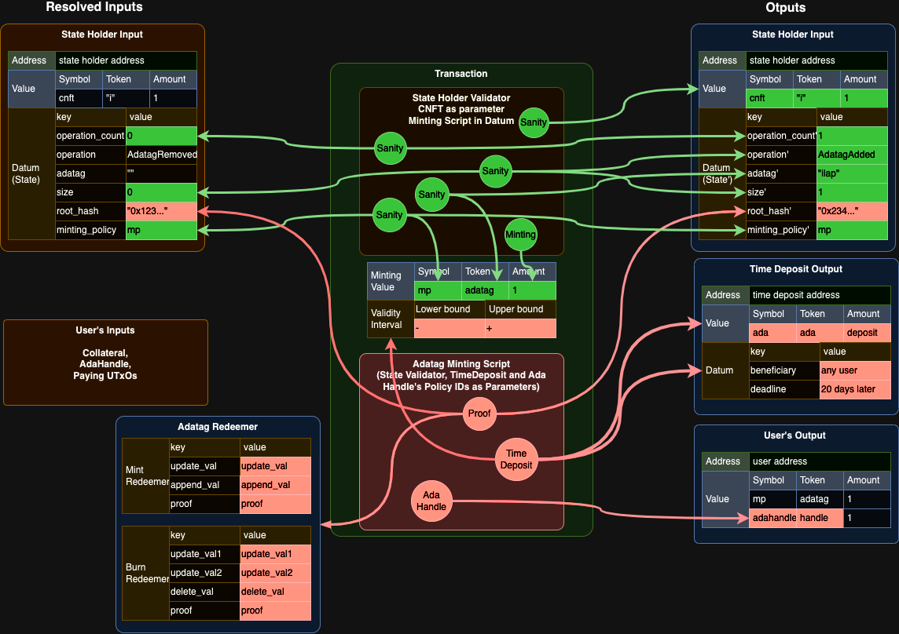

## Diagram

[](https://drive.google.com/file/d/1QFfs-XG9c2l8JuDH4ZIquc3FSVDM5rVA/view?usp=sharing)

## Security considerations

Tokens, other than authorization tokens, sent to the state holder validator address are considered as adversarial attempts and will be locked forever.
Tokens, with invalid-timedeposit-datum, sent to the timelock validator are considered as donations.
Tokens, sent to the adatag minting policy are considered adversarial attempts and will be locked forever.

For mitigating:

- Unathenticated UTxO
- Double satisfaction
- Infinite minting
- Unbounded value

## Building

```sh
aiken build
```

## Testing

You can write tests in any module using the `test` keyword. For example:

```gleam
test foo() {
  1 + 1 == 2
}
```

To run all tests, simply do:

```sh
aiken check
```

To run only tests matching the string `foo`, do:

```sh
aiken check -m foo
```

## Documentation

If you're writing a library, you might want to generate an HTML documentation for it.

Use:

```sh
aiken docs
```

## Resources

Find more on the [Aiken's user manual](https://aiken-lang.org).

## Comparison

| Feature                    | Complete Binary Tree                                                                               | Merkle Tree                                                                                                    | Merkle Sparse Tree                                                                                    | Merkle Patricia Tree                                                                                       |
| -------------------------- | -------------------------------------------------------------------------------------------------- | -------------------------------------------------------------------------------------------------------------- | ----------------------------------------------------------------------------------------------------- | ---------------------------------------------------------------------------------------------------------- |
| **Structure**              | Binary tree where each level is fully filled except possibly the last level, which is left-filled. | Tree where each leaf node represents a data block, and internal nodes represent hash values of their children. | Similar to Merkle Tree, but with nodes having null (empty) values omitted, reducing the overall size. | Extension of a Merkle Trie, optimized for key-value pairs. Each node has a prefix associated with the key. |
| **Node Values**            | Contains data values at the leaf nodes.                                                            | Contains hash values at internal and leaf nodes.                                                               | Similar to Merkle Tree but with nodes potentially missing for null (empty) values.                    | Internal nodes store hashes, and leaf nodes store key-value pairs.                                         |
| **Efficiency**             | Efficient for quick retrieval and insertion of elements.                                           | Efficient for verifying data integrity, especially in a distributed system.                                    | Optimized for sparse data sets, reducing storage and computation costs.                               | Efficient for key-value storage and retrieval, especially in blockchain applications.                      |
| **Storage Size**           | Generally larger due to complete filling of levels.                                                | Smaller compared to a complete binary tree, as each node stores only hash values.                              | Smaller than a Merkle Tree due to omitted null values.                                                | Storage efficiency depends on the structure and density of key-value pairs.                                |
| **Insertion/Deletion**     | Requires restructuring for efficient insertion and deletion.                                       | Limited in terms of dynamic updates; typically used for static data sets.                                      | More flexibility than Merkle Tree, but still may require restructuring for updates.                   | Efficient for insertion and deletion, especially in blockchain applications.                               |
| **Use Cases**              | Binary heap, priority queues.                                                                      | Data integrity verification, especially in cryptocurrencies (e.g., Bitcoin).                                   | Sparse data sets, blockchain applications.                                                            | Ethereum's state trie for contract storage.                                                                |
| **Examples in Blockchain** | Not commonly used directly in blockchain applications.                                             | Commonly used to verify the integrity of transactions and blocks.                                              | Used to optimize storage in Ethereum's state trie.                                                    | Used in Ethereum's state trie for key-value storage.                                                       |
